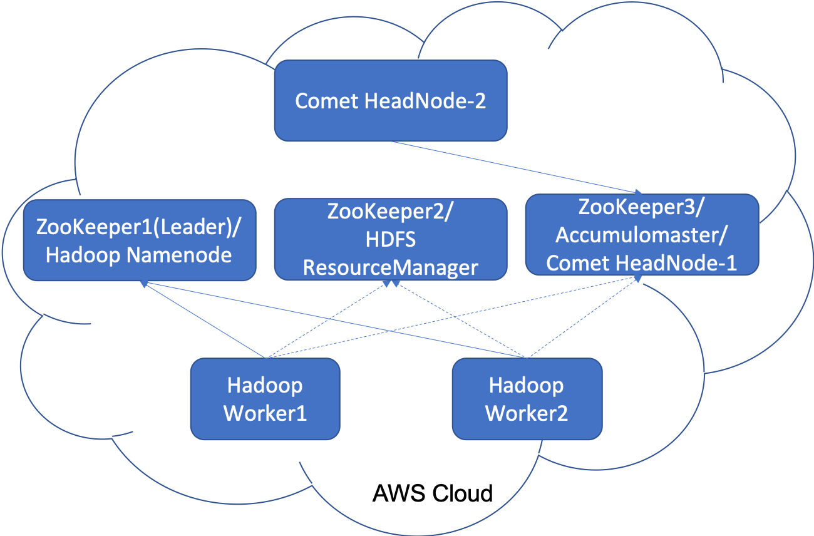
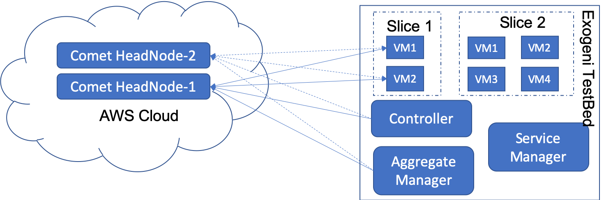
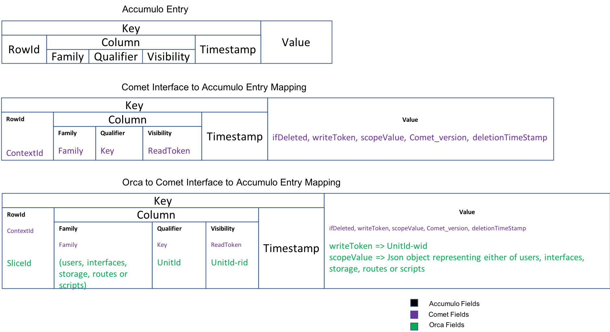
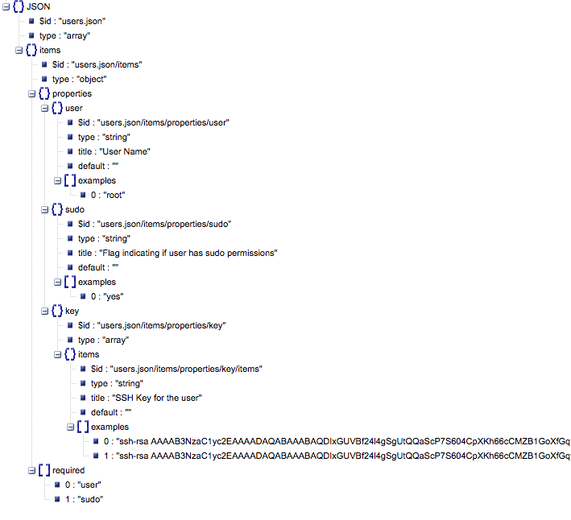
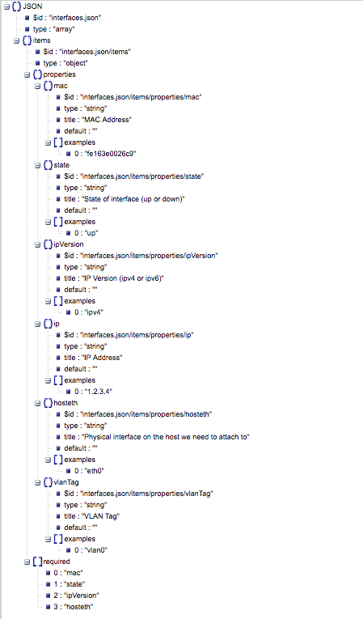
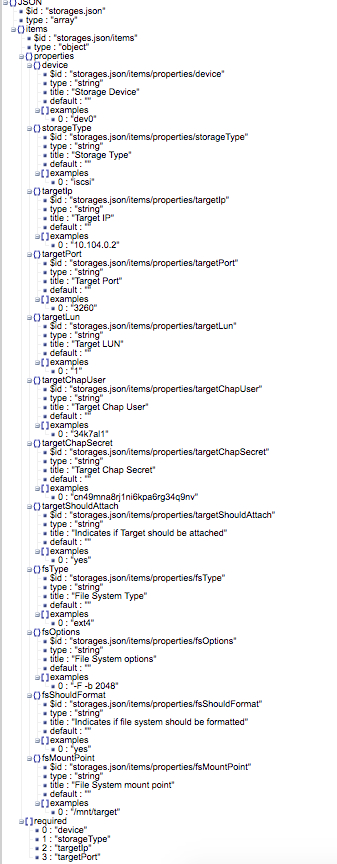
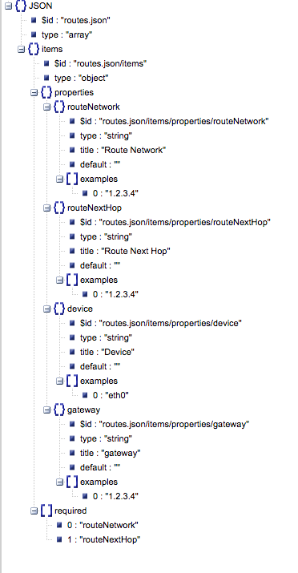
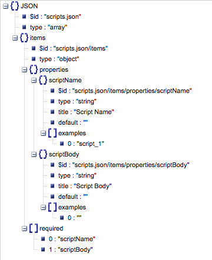
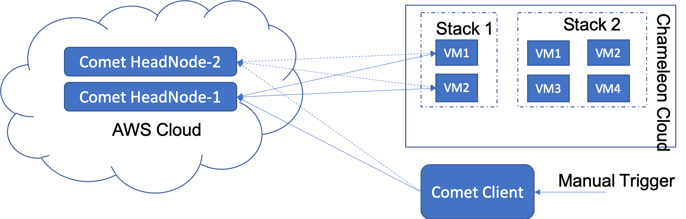
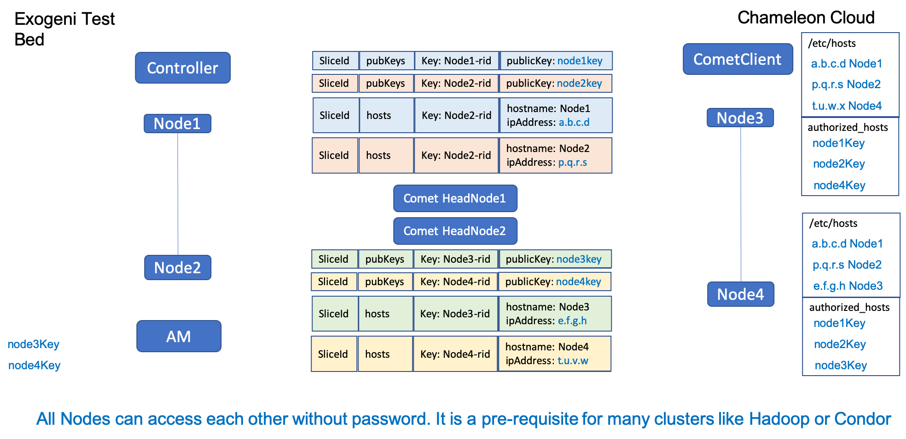

# Orca with COMET

## COMET Architecture (Deployed in AWS Cloud)


## COMET Interaction with NSF Exogeni
Controller pushes Slice scope context per VM Instances to COMET as place holder for SSH Keys, Hostnames etc.
Aggregate Manager pushes VM(Instance) specific data to COMET like Users, Interfaces, Routes, Scripts and Storage
- VM pulls instance specific information like Users, Interfaces, Routes, Scripts and Storage and configures itself
- VM pushes it’s own Hostname and SSH Keys to COMET
- VM pulls HostNames of other VMs in it’s groups and maintains /etc/hosts 
- VM pulls Public Keys of other VMs in it’s groups and maintains them in authorized_hosts


### ORCA Controller Config
Controller config should include following parameters:
```
comethost=https://18.224.135.20:8111/,https://18.221.238.74:8111/
comet.cacert=/etc/orca/am+broker-12080/ssl/DigiCertCA.der
comet.clientkeystore=/etc/orca/am+broker-12080/ssl/client.jks
comet.clientkeystorepwd=changeme
comet.clientcert=/etc/orca/am+broker-12080/ssl/inno-hn_exogeni_net.pem
comet.clientkey=/etc/orca/am+broker-12080/ssl/inno-hn_exogeni_net.key
orca.comet.pubkeys.enabled=true
orca.comet.hosts.enabled=true
```
### ORCA AM Config
AM config should include following parameters:
```
comethost=https://18.224.135.20:8111/,https://18.221.238.74:8111/
comet.cacert=/etc/orca/am+broker-12080/ssl/DigiCertCA.der
comet.clientkeystore=/etc/orca/am+broker-12080/ssl/client.jks
comet.clientkeystorepwd=changeme
comet.clientcert=/etc/orca/am+broker-12080/ssl/inno-hn_exogeni_net.pem
comet.clientkey=/etc/orca/am+broker-12080/ssl/inno-hn_exogeni_net.key
```

### Design Details
ORCA uses COMET to pass properties to VM instead of ini files from AM. Using comet instead of ini files is a pre-requisite for the Openstack upgrade. This ensures that no modifications are required in openstack.

#### Schema for Comet

##### Users JSON Schema
Users information will be stored in scopeValue field.

##### Interfaces JSON Schema
Interfaces information will be stored in scopeValue field.

##### Storage JSON Schema
Storage information will be stored in scopeValue field.

##### Routes JSON Schema
Routes information will be stored in scopeValue field.

##### Scripts JSON Schema
Scripts information will be stored in scopeValue field.


#### Instance Userdata
ORCA maintains following COMET specific parameters in each instance user data. These parameters are used by neuca-guest-tools to configure instance by fetching information via COMET.

Neuca-guest-tools are responsible for setting up users, interfaces, storage, scripts, routes on each instance. They also setup /etc/hosts for each instance such that all the hostnames in the slice are present in /etc/hosts. In addition, they setup /root/.ssh/authorized_keys to add a key for each instance.

```
comethost=https://18.224.135.20:8111/,https://18.221.238.74:8111/
cometreadtoken=XXXXXXXX
slicecometreadtoken=XXXXXXXX
slicecometwritetoken=XXXXXXXXX
comethostsgroupread=all
comethostsgroupwrite=all
cometpubkeysgroupread=all
cometpubkeysgroupwrite=all
```

## COMET Interaction with Chameleon
User pushes Slice scope context per VM Instances to COMET as place holder for SSH Keys, Hostnames etc using Comet Client.
- VM pushes it’s own Hostname and SSH Keys to COMET
- VM pulls HostNames of other VMs in it’s groups and maintains /etc/hosts 
- VM pulls Public Keys of other VMs in it’s groups and maintains them in authorized_hosts


## COMET Inter Cloud Connectivity

