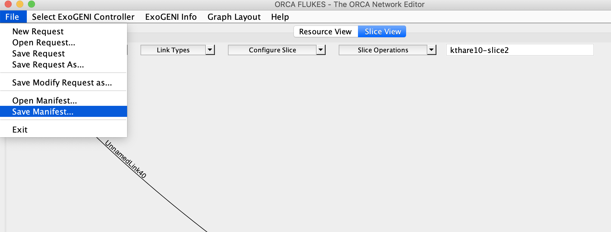
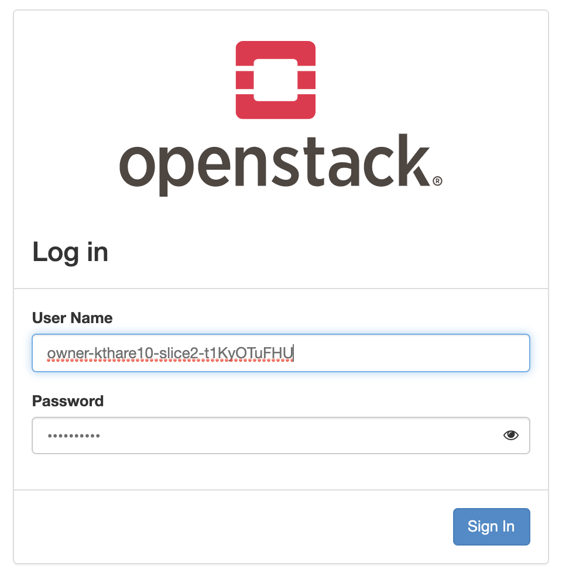
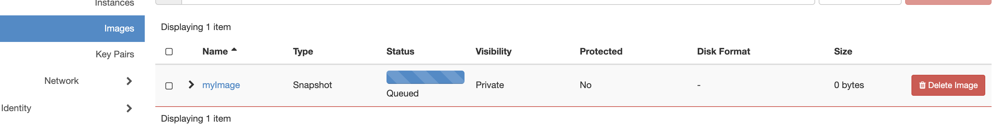
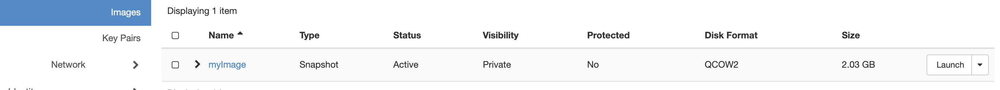

# Images
With new ORCA release, users can create their images as below.

## Determine Horizon details
Save manifest of the slice which contains the VM for which image needs to be created as shown below


View the manifest to find horizon details:
```
   <rdf:Description rdf:about="http://geni-orca.renci.org/owl/9d396ac0-781c-4627-b3d8-dbe7b0c4f71b#Node0">
     <rdf:type rdf:resource="http://geni-orca.renci.org/owl/compute.owl#ComputeElement"/>
     <j.4:inDomain rdf:resource="http://geni-orca.renci.org/owl/rockyvmsite.rdf#rockyvmsite/Domain/vm"/>
     <j.4:message>Reservation 5dfc3dba-f845-4d84-a53b-235472a7b1f1 (Slice kthare10-slice2) is in state [Active,None]
 </j.4:message>
     <j.4:postBootScript>touch /root/psb_was_here
 </j.4:postBootScript>
     <j.4:hasReservationState rdf:resource="http://geni-orca.renci.org/owl/request.owl#Active"/>
     <j.4:dependOn rdf:resource="http://geni-orca.renci.org/owl/9d396ac0-781c-4627-b3d8-dbe7b0c4f71b#Storage0"/>
     <j.9:hasResourceType rdf:resource="http://geni-orca.renci.org/owl/compute.owl#VM"/>
     <j.17:hasInterface rdf:resource="http://geni-orca.renci.org/owl/9d396ac0-781c-4627-b3d8-dbe7b0c4f71b#C2S0-Node0"/>
     <j.17:hasInterface rdf:resource="http://geni-orca.renci.org/owl/9d396ac0-781c-4627-b3d8-dbe7b0c4f71b#C2S0-Node0/4/intf"/>
     <j.17:hasGUID>f2eb963d-5466-4580-927d-bb177526e41d</j.17:hasGUID>
     <j.12:specificCE rdf:resource="http://geni-orca.renci.org/owl/exogeni.owl#XOMedium"/>
     <j.12:diskImage rdf:resource="http://geni-orca.renci.org/owl/9d396ac0-781c-4627-b3d8-dbe7b0c4f71b#fedora30-v1.2-comet"/>
     <j.17:hasURL>http://geni-orca.renci.org/owl/rockyvmsite.rdf#rockyvmsite/Domain/vm</j.17:hasURL>
     <j.1:hasInstanceID>af8b1c13-2057-4831-9d3a-7ae481bd89e3</j.1:hasInstanceID>
     <j.1:workerNodeID>rocky-w1</j.1:workerNodeID>
     <j.5:hasParent rdf:resource="http://geni-orca.renci.org/owl/9d396ac0-781c-4627-b3d8-dbe7b0c4f71b#C2S0/Node0"/>
     <j.9:hasService rdf:resource="http://geni-orca.renci.org/owl/9d396ac0-781c-4627-b3d8-dbe7b0c4f71b#Node0/Service"/>
     <j.1:hasHorizonUserName>owner-kthare10-slice2-t1KyOTuFHU</j.1:hasHorizonUserName>
     <j.1:hasHorizonUserPwd>tv4KS5ePKo</j.1:hasHorizonUserPwd>
     <j.1:hasHorizonUrl>http://152.54.14.213/dashboard/identity/</j.1:hasHorizonUrl>
   </rdf:Description>
```
## Horizon dashboard
Access dashboard using credentials determined above.



## Create Image
Go to Compute -> Instances screen and select VM from which to create the image and click 'Create Snapshot'


Go to Compute -> Images screen to check status of image. It would change from queued to Active



## Download Image
NOTE: Needs to be investigated for Users. For developer can be done as below:
- Logon to head node and swithc to root user
- Source Openstack keystone and execute following commands
```
source ./xo-openstack-rc/keystonerc_admin
openstack image list
+--------------------------------------+------------------------------------------------------------+--------+
| ID                                   | Name                                                       | Status |
+--------------------------------------+------------------------------------------------------------+--------+
| 494ca0f5-8a37-4880-858d-abce4874b5e7 | myImage                                                    | active |
+--------------------------------------+------------------------------------------------------------+--------+
glance image-download --file /tmp/myImage.qcow2 494ca0f5-8a37-4880-858d-abce4874b5e7 
```

## CLI mechanism to create the image (only to be used by developers)
- Logon to head node and swithc to root user
- Source Openstack keystone and execute following command
```
source  /var/tmp/cred.tenant-kthare10-slice2-aD7NZwyeV8.owner-kthare10-slice2-aD7NZwyeV8
openstack server list
nova image-create <server_name> <image_name>
openstack image show <image_name>
glance image-download --file /tmp/<image_name>.qcow2 <image_id>
```
NOTE: credentials file for each slice would be present in /var/tmp directory with convention /var/tmp/cred.tenant-<slice-name>...
