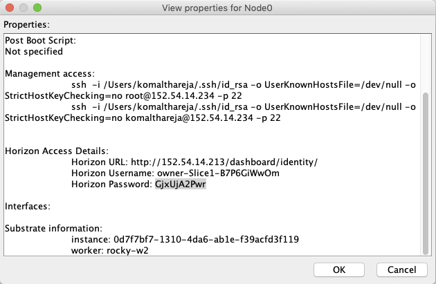
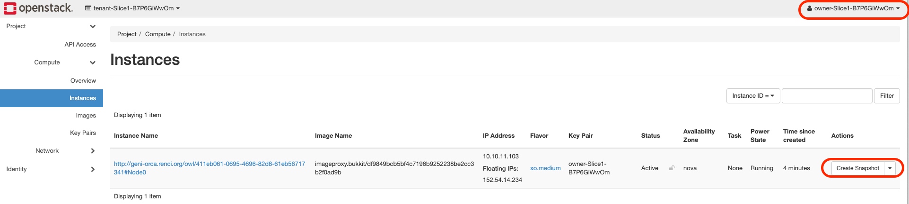
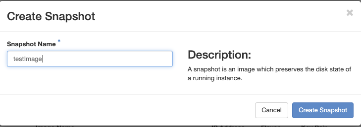
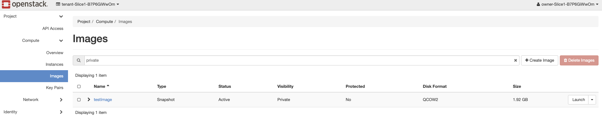
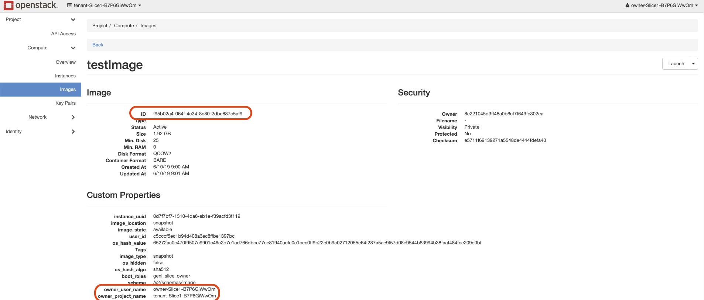

# Images
With new ORCA release, users can create their images as below.

## Determine Horizon details
Select the Node and rigt click to View Properties of the Node in flukes


## Horizon dashboard & Create Image
Access dashboard using credentials determined above and go to Compute -> Instances screen. Note down the Project Name shown on the top left corner.



Select VM from which to create the image and click 'Create Snapshot'



Go to Compute -> Images screen to check status of image. It would change from queued to Active



Once the image is Active, click on Image Name to find out ID.


## Download Image
Download python image client which is required to download the image. Use the python client to download the image as indicated below.

```
wget  http://geni-images.renci.org/images/tools/image_client.py

python3.6 image_client.py -e http://rocky-hn.exogeni.net:8222 -p tenant-Slice1-B7P6GiWwOm -u owner-Slice1-B7P6GiWwOm -w GjxUjA2Pwr -i f95b02a4-064f-4c34-8c80-2dbc887c5af9 -f ./testImage.qcow2
```
NOTE: Python 3.6 and requests package should be installed before running image_client

## Create xml file for the image
- Generate shasum for the image
```
sha1sum testImage.qcow2
df9849bcb5bf4c7196b9252238be2cc3b2f0ad9b
```
- image xml file should include sha1sum for the image and http link to download the image as shown below:
```
<images>
     <image>
          <type>QCOW2</type>
          <signature>df9849bcb5bf4c7196b9252238be2cc3b2f0ad9b</signature>
          <url>http://<url for the location of the image>/testImage/testImage.qcow2</url>
     </image>
</images>
```
## CLI mechanism to create the image (only to be used by developers)
- Logon to head node and swithc to root user
- Source Openstack keystone and execute following command
```
source  /var/tmp/cred.tenant-kthare10-slice2-aD7NZwyeV8.owner-kthare10-slice2-aD7NZwyeV8
openstack server list
nova image-create <server_name> <image_name>
openstack image show <image_name>
glance image-download --file /tmp/<image_name>.qcow2 <image_id>
```
NOTE: credentials file for each slice would be present in /var/tmp directory with convention /var/tmp/cred.tenant-<slice-name>...
